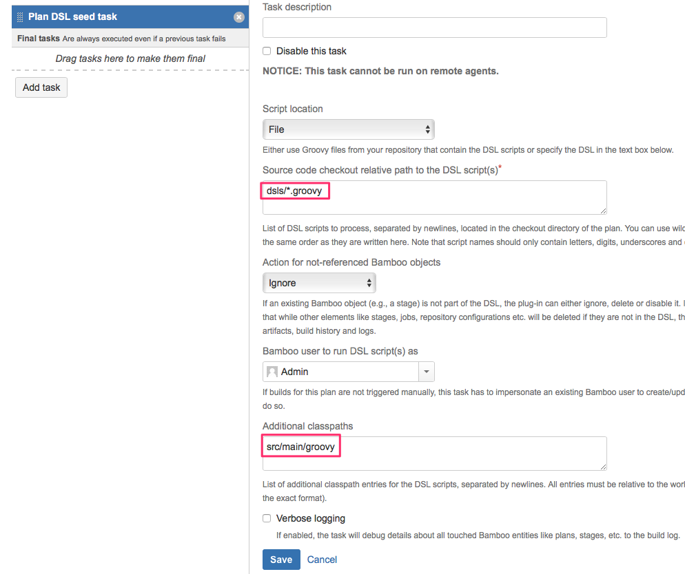

# Plan DSL example project

An example project for writing both Groovy DSL scripts and YAML files for the 
[Plan DSL for Bamboo](https://github.com/mibexsoftware/bamboo-plan-dsl-plugin/) plug-in in IntelliJ with
testing support. It also shows how to put common Groovy DSL code into separate files for better reuse (see `MyUtility.groovy`).

For more information regarding the syntax of the Groovy DSL/YAML, please see the
[API documentation](https://mibexsoftware.github.io/bamboo-plan-dsl-plugin/).

Note that you need to add `src/main/groovy` to the field 'additional classpaths' of the Bamboo plug-in seed task to
execute the DSL script in this repository:

